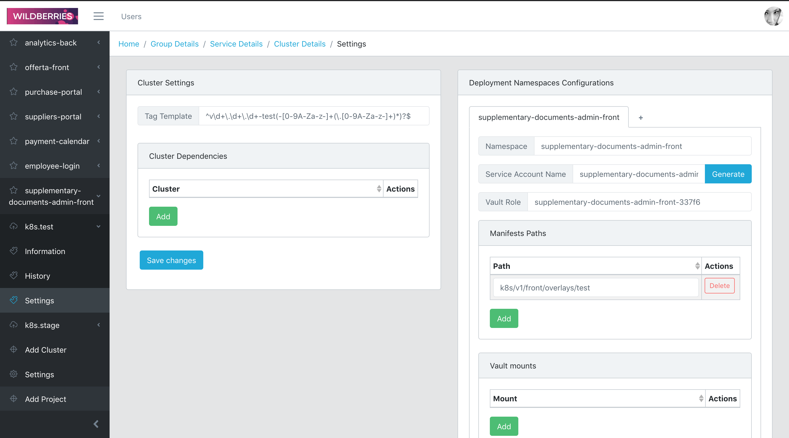
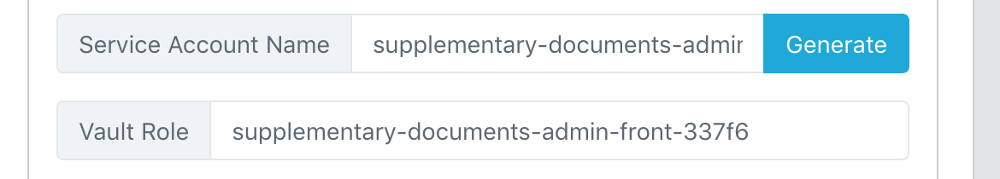

# Инструкция по деплою

Для начала здесь (http://api.deploy-service.svc.k8s.datapro) надо получить доступ, его выдаст Александр Черников `@frankegoesdown`

## Настройка deploy-service

Не забывай нажимать кнопку `Save changes` каждый раз

#### Создание проекта

После того как получишь логин и пароль для входа, создаешь проект как названа твоя репа

 
 
и генерируешь ключ

 
 

#### Создание кластера

Создаешь кластер `k8s.test`, копируешь все настройки с любого другого такого же кластера

 
 
Обрати внимание, это не заполняется, тут надо опять написать Черникову, чтобы он нажал на кнопку Generate

 
 
Также обрати внимание здесь. Тут от кластера к кластеру конфиг может отличатся, тут 8 команд, но может быть 9 (например в `k8s.stage`)

 
 

#### Зависимости

Теперь насчет зависимостей:  
У тебя для деплоя есть 4 кластера:

1.  test — для стадии тестов
2.  stage — для стадии тестов
3.  datapro — для продакшена
4.  dataline — для продакшена

`stage` зависит от `test` , поэтому в этом кластере стейджа мы указываем название `test` кластера. 

 
 
`datapro` зависит от stage 
`dataline` зависит от stage 
 
 

#### Регулярки

- test –– `^v\d+\.\d+\.\d+-test(-[0-9A-Za-z-]+(\.[0-9A-Za-z-]+)*)?$`
- stage –– `^v\d+\.\d+\.\d+-stage(-[0-9A-Za-z-]+(\.[0-9A-Za-z-]+)*)?$`
- dataline –– `^v\d+\.\d+\.\d+-dataline(-[0-9A-Za-z-]+(\.[0-9A-Za-z-]+)*)?$`
- datapro –– `^v\d+\.\d+\.\d+-datapro(-[0-9A-Za-z-]+(\.[0-9A-Za-z-]+)*)?$`

 
 

## Настройка репозитория

...........................

В админке деплой сервиса должны появится твои теги:

## FAQ

#### –– Если я залил изменения в ветку надо ли делать тег заново?

Да, если ты изменил и залил, то это соответственно уже другой коммит.
Очень важно чтобы **ВСЕ** теги были созданы из одного и того же коммита. 
Иначе просто не поднимутся все кластеры кроме теста.  
 
 

#### –– В каком порядке создавать теги (если делать всё самому, без скрипта-для-деплоя)?

Теги создаются в порядке:
 
`test` ––> `stage` ––> `dataline`, `datapro` (два последних можно запустить параллельно)
 
 

#### –– Когда какие теги и кластеры создавать?

- `test` –– когда нужно протестировать фронт, если после разработки впервые надо выкатить фронт, достаточно только этого тега(и кластера соответственно). Также подходит для интеграции в "оболочку", но бекендеры для этой цели просят именно `stage`.
- `stage` –– когда бекендеру нужно интегрировать твой фронт в так называемую "оболочку", перед запуском этого тега необходим уже запущенный `test` тэг. `stage` тэг запускаешь соответственно с того же коммита, с которого запускал `test` тег
- `dataline` и `datapro` –– когда всё готово к тому, чтобы выкатывать на продакшен, перед запуском этих тегов требуются `test` и `stage` тэги (получается, что при выкатке на прод надо по-новому создать все теги, из ветки `release/<версия>`). Запускать `dataline` и `datapro` можно параллельно. Запускаешь соответственно с того же коммита, с которого запускал `test` и `stage` теги

#### –– По какой ссылке посмотреть мой фронт?

Дальше теги проходят пайплайны, (пайплайн release, который мы настраивали в
файле `.gitlab-ci.yml` должен пройти) на деплой сервисе происходит магия
(надо подождать минут 2-3 (если не `test` стенд)
если не поднялось на стенде то надо идти спрашивать у Димы Краснова) и все,
твой фронт будет доступен по адресу:
 `http://front.<namespace>.svc.k8s.<название-кластера>` 
поскольку мы выбрали в качестве неймспейса название репы, то ее и указываем, 
например: http://front.supplementary-documents-admin-front.svc.k8s.stage
