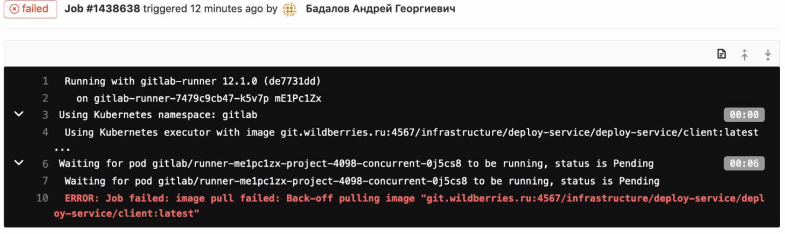
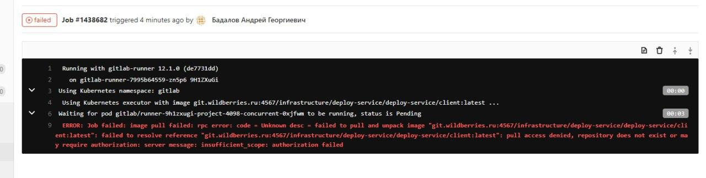
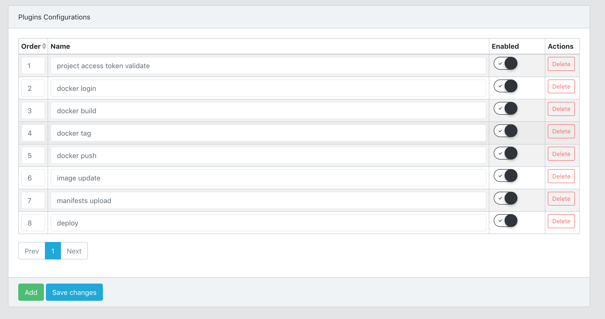
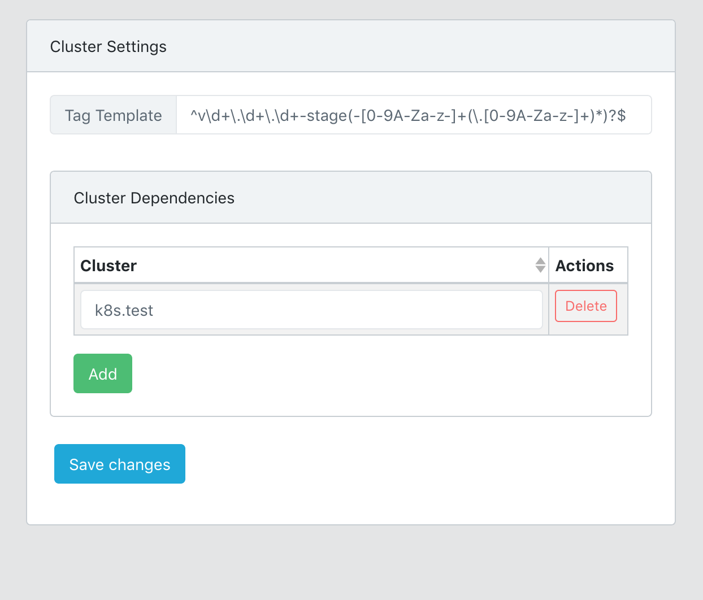
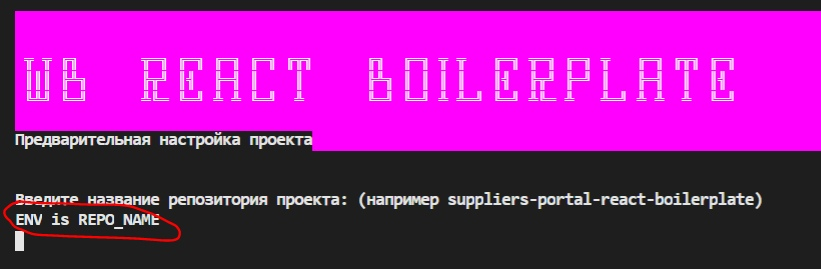
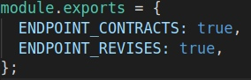
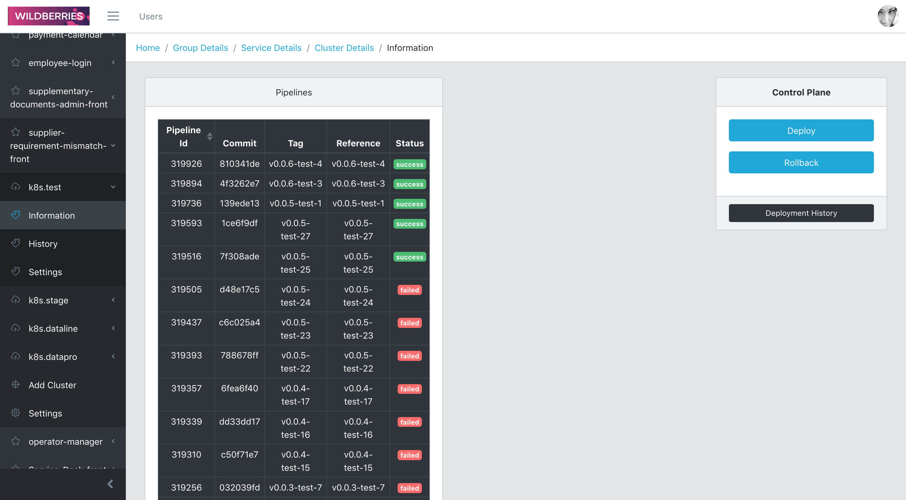

# Инструкция по деплою

Для начала здесь (http://api.deploy-service.svc.k8s.datapro) надо получить доступ, его выдаст Александр Черников `@Vladimir_Kleusov` 
Затем надо написать `@abernod137`, чтобы он выдал доступы. В сообщении можете приложить скрины ниже, 
чтобы было понятно, какой именно доступ тебе нужен. 
Скрины ошибок если нет доступа: 

или такой

## Настройка deploy-service

Не забывай нажимать кнопку `Save changes` каждый раз

#### Создание проекта

После того как получишь логин и пароль для входа, создаешь проект как названа твоя репа
**Без заглавных букв! Например твоя репа называется `Service-Desk-front` надо назвать проект `service-desk-front`**

 
 
и генерируешь ключ

 
 

#### Создание кластера

Создаешь кластер `k8s.test`, копируешь все настройки с любого другого такого же кластера

 
 
Обрати внимание, это не заполняется, тут надо опять написать Черникову, чтобы он нажал на кнопку Generate

 
 
Также обрати внимание здесь. Тут от кластера к кластеру конфиг может отличатся, тут 8 команд, но может быть 9 (например в `k8s.stage`)

 
 

#### Зависимости

Теперь насчет зависимостей:  
У тебя для деплоя есть 4 кластера:

1.  test — для стадии тестов
2.  stage — для стадии тестов
3.  datapro — для продакшена
4.  dataline — для продакшена

`stage` зависит от `test` , поэтому в этом кластере стейджа мы указываем название `test` кластера. 

 
 
`datapro` зависит от stage 
`dataline` зависит от stage 
 
 

#### Регулярки

- test –– `^v\d+\.\d+\.\d+-test(-[0-9A-Za-z-]+(\.[0-9A-Za-z-]+)*)?$`
- stage –– `^v\d+\.\d+\.\d+-stage(-[0-9A-Za-z-]+(\.[0-9A-Za-z-]+)*)?$`
- dataline –– `^v\d+\.\d+\.\d+-dataline(-[0-9A-Za-z-]+(\.[0-9A-Za-z-]+)*)?$`
- datapro –– `^v\d+\.\d+\.\d+-datapro(-[0-9A-Za-z-]+(\.[0-9A-Za-z-]+)*)?$`

 
 

## Настройка репозитория

**Не забудь, что выкатываем на какой бы то ни было стенд(test, stage, dataline, datapro)
только с ветки `release/<версия>` например, `release/1.0` (подробнее об этом ниже в разделе FAQ)**
 
Запускаем npm run setup
Получаем в окошке терминала опросник, который задает нам переменные в файле .env
(рядом с каждым из вопросов отображается за какую переменную данный вопрос отвечает)

 
 

### –– Какие переменные за что отвечают

#### –– Обычная модификация

<b>REACT_APP_ROUTER_PREFIX</b> - префикс первого роута приложения (если он один то должен заканчиваться на /)
 
<b>DEPLOY_TOKEN</b> - токен деплоя от админки ci-cd
 
<b>REPO_NAME</b> - название репозитория (также как и нэймспейса в админке ci-cd)
 
<b>SERVER_PORT</b> - порт на котором поднимается сервер статики
 
<b>IP_LIMIT</b> - количество допустимых запросов в минуту с одного ip
 
<b>BROWSER</b> - настройка create-react-app для автозапуска браузера при старте приложения
 
<b>PUBLIC_URL</b> - префикс для сборки статических файлов
 

#### –– Модификация --euro (европортал)

<b>REACT_APP_ROUTER_PREFIX</b> - префикс первого роута приложения, начинается с / (если он один то НЕ должен заканчиваться на /)
 
<b>PROJECT_NAME</b> - название проекта (НЕ также как и нэймспейса в админке ci-cd, а как название для подключения в меню платформы - узнать название у ответственных за платформу)
 
<b>DEPLOY_TOKEN</b> - токен деплоя от админки ci-cd
 
<b>REPO_NAME</b> - название репозитория (также как и нэймспейса в админке ci-cd)
 
<b>BROWSER</b> - настройка create-react-app для автозапуска браузера при старте приложения
 
 

Далее вводим свои переменные для эндпоинтов (Для обычной модификации "не евро" помимо урлов для запросов нужны переменные SERVER_PORT, IP_LIMIT) в файлах:
 
`config/deploy/template_ci.sh (во всех местах где встречается секция env)`

 

Вводим свои переменные для эндпоинтов (в евро нет)
`config/deploy/frontend-envs.js`
 

Вводим свои переменные для эндпоинтов (в евро нет)
`src/react-app-env.d.ts`
 

Далее выбираем команду для деплоя из списка (промежуток между закидыванием тагов 250 секунд для решения проблемы последовательных деплоев на стенды)
 

 
 

В админке деплой сервиса должны появится твои теги:
 

 
 

## Примеры

#### –– Обычная модификация

https://git.wildberries.ru/portals/suppliers-multiplicity-front

#### –– Модификация --euro (европортал)

https://git.wildberries.ru/infrastructure/suppliers-portal-eu-registration

## FAQ

#### –– Как мне правильно работать с ветками (release, develop)?

Для начала стоит железно запомнить, что **любой** деплой, будь то просто протестить как фронт будет выглядеть
вместе с "оболочкой" или выкатиться на продакшен, **ты запускаешь `скрипт-для-деплоя` только находясь на ветке `release/<версия>`**
 
Теперь подробнее остановимся на возможных кейсах: 
**Фронт готов, тебе надо выкатится и потестить** –– в этом случае твои шаги:

- создаешь `release/1.0` ветку из `develop`
- делаешь чекаут на нее
- из нее запускаешь скрипт-для-деплоя

**Фронт НЕ готов, но ты хочешь потестить/посмотреть** –– в этом случае твои шаги:

- создаешь `release/1.0` ветку из `develop`
- делаешь чекаут на нее
- из нее запускаешь скрипт-для-деплоя
- удаляешь ветку `release/1.0`, после того как потестил, что тебе требовалось

**У тебя уже есть ветка `release`, но ты нашел баги и хочешь их пофиксить** –– в этом случае твои шаги:

- создаешь ветку hotfix/<название-фикса> из `release`
- фиксишь в ней свои баги
- создаешь 2 МР'а в ветки `release` и `develop`
- после того как твой фикс замержат в обе ветки ты заходишь на ветку `release`
- из нее запускаешь скрипт-для-деплоя

**У тебя уже есть ветка `release`, ты исправил все баги, теперь тебе надо релизить на продакшен стенд** –– в этом случае твои шаги:

- удостоверься, что ветки `release` и `develop` абсолютно идентичны
- делаешь чекаут на нее
- из нее запускаешь скрипт-для-деплоя

**У тебя уже есть ветка `release`, но требуется добавить новый функционал** –– в этом случае твои шаги:

- удостоверься, что ветки `release` и `develop` абсолютно идентичны
- создавай новую ветку `release`, инкрементируя версию (было `release/1.0` стало `release/1.1`)
- делаешь чекаут на нее
- из нее запускаешь скрипт-для-деплоя

#### –– Если я залил изменения в ветку надо ли делать тег заново?

Да, если ты изменил и залил, то это соответственно уже другой коммит.
Очень важно чтобы **ВСЕ** теги были созданы из одного и того же коммита. 
Иначе просто не поднимутся все кластеры кроме теста.  
 
 
#### –– У меня тег упал, что делать?
1) Для начала проверь запустились ли твои теги в правильном порядке. То есть тест тег мог еще не задеплоится, а стейдж 
уже начал выполнятся. Иногда есть вероятность, что 200миллисек не хватает между деплоями тегов. Зайди в ci-cd гитлаба
и проверь пайплайны, если проблема действительно в этом, просто рестартни пайплайны в правильном порядке.
2) Если теги запустились правильно, но все равно есть какая-то ошибка, то **не пытайся перезапустить один и тот же тег**. 
Для начала исправь проблему, которая могла привести к падению тега, затем снова запускай теги. 
Например: тег `v0.0.4-test-5` задеплоился на деплой-сервис, но не работает. Ты не удаляешь этот тег и создаешь 
такой же, а **инкрементируешь версию** (`v0.0.5-test-1`) и запускаешь новый тег.  
То есть если в админке уже есть тег во вкладке Information, то не надо пытаться перезапустить его, просто сделай новый тег.

#### –– В каком порядке создавать теги (если делать всё самому, без скрипта-для-деплоя)?

Теги создаются в порядке:
 
`test` ––> `stage` ––> `dataline`, `datapro` (два последних можно запустить параллельно)
 
 

#### –– Когда какие теги и кластеры создавать?

- `test` –– когда нужно протестировать фронт, если после разработки впервые надо выкатить фронт, достаточно только этого тега(и кластера соответственно). Также подходит для интеграции в "оболочку", но бекендеры для этой цели просят именно `stage`.
- `stage` –– когда бекендеру нужно интегрировать твой фронт в так называемую "оболочку", перед запуском этого тега необходим уже запущенный `test` тэг. `stage` тэг запускаешь соответственно с того же коммита, с которого запускал `test` тег
- `dataline` и `datapro` –– когда всё готово к тому, чтобы выкатывать на продакшен, перед запуском этих тегов требуются `test` и `stage` тэги (получается, что при выкатке на прод надо по-новому создать все теги, из ветки `release/<версия>`). Запускать `dataline` и `datapro` можно параллельно. Запускаешь соответственно с того же коммита, с которого запускал `test` и `stage` теги

#### –– По какой ссылке посмотреть мой фронт?

Дальше теги проходят пайплайны, (пайплайн release, который мы настраивали в
файле `.gitlab-ci.yml` должен пройти) на деплой сервисе происходит магия
(надо подождать минут 2-3 (если не `test` стенд)
если не поднялось на стенде то надо идти спрашивать у Димы Краснова) и все,
твой фронт будет доступен по адресу:
 `http://front.<namespace>.svc.k8s.<название-кластера>` 
поскольку мы выбрали в качестве неймспейса название репы, то ее и указываем, 
например: http://front.supplementary-documents-admin-front.svc.k8s.stage
